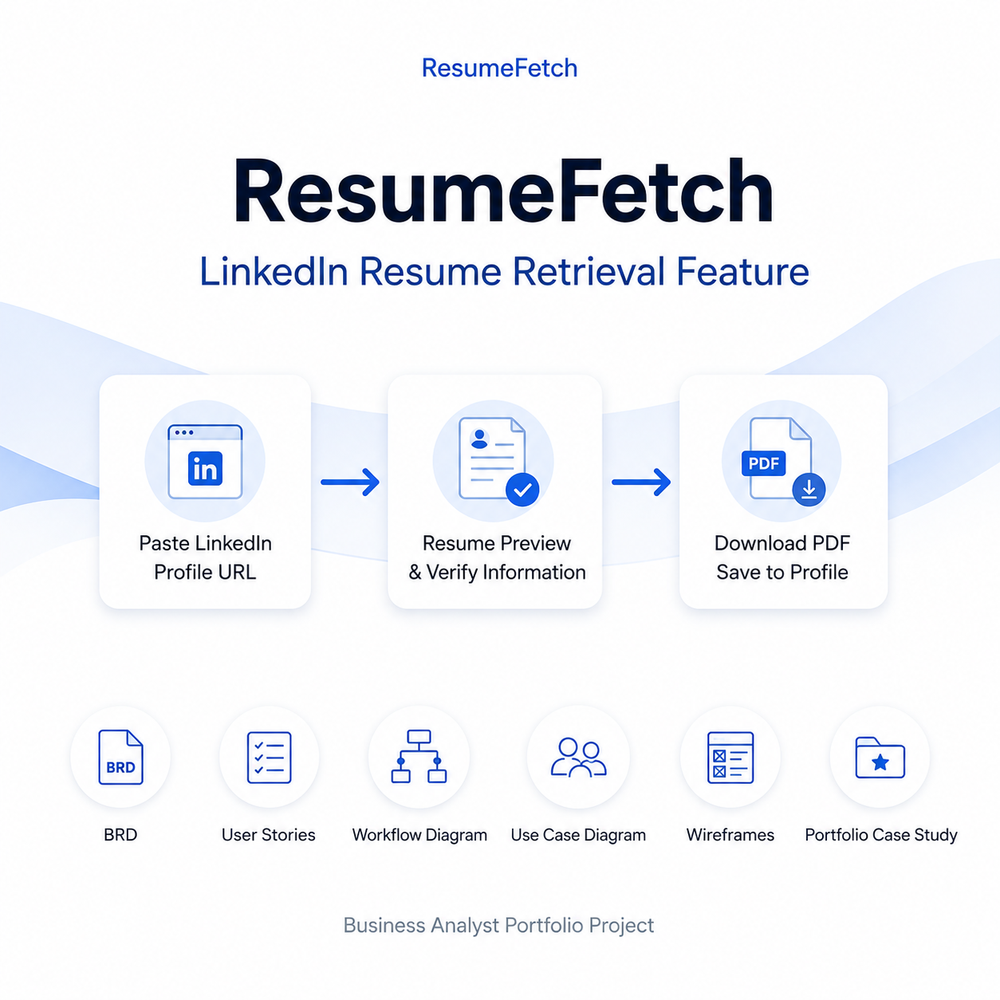

# ResumeFetch – LinkedIn Resume Retrieval Feature


<p align="center">
  
</p>

## Overview

ResumeFetch is a Business Analyst portfolio project that proposes a feature enabling job applicants to retrieve the resume already uploaded and associated with their LinkedIn profile instead of manually uploading the same file for every job application.

This project demonstrates the complete Business Analysis lifecycle, from identifying a business problem to defining requirements, designing wireframes, creating process models, and documenting the proposed solution.

---

## Problem Statement

Job applicants repeatedly upload the same resume for every application despite already maintaining an up-to-date resume on LinkedIn. This repetitive process creates unnecessary effort, increases application time, and negatively impacts the candidate experience.

---

## Proposed Solution

ResumeFetch allows candidates to paste their LinkedIn profile URL. The system validates the URL, retrieves the resume associated with that profile, and displays it in a preview screen along with the parsed Experience and Skills sections for verification.

After confirming that the information is accurate and up to date, candidates can:

- Download the resume as a PDF
- Save the resume directly to their job portal profile

If no resume is found, the system provides an option to upload a resume manually, ensuring the application process can continue without interruption.

---

## Project Objectives

- Improve the candidate application experience
- Reduce repetitive resume uploads
- Minimize manual effort during job applications
- Increase consistency of resume information across applications
- Demonstrate Business Analysis documentation and solution design

---

## Business Analysis Deliverables

| Deliverable | Description |
|-------------|-------------|
| BRD | Business requirements and project scope |
| User Stories | Functional requirements written from the user's perspective |
| Workflow Diagram | End-to-end business process flow |
| Use Case Diagram | System interactions between the actor and feature |
| Wireframes | Low-fidelity UI screens for the proposed feature |
| Portfolio Case Study | End-to-end documentation of the project |

---

## Repository Structure

```
ResumeFetch-BA-Portfolio
│
├── Assets
│   └── ResumeFetch_Cover.png
│
├── Project Documentation
│   ├── ResumeFetch_Project_Overview.pdf
│   ├── ResumeFetch_BRD.pdf
│   ├── ResumeFetch_User_Stories.pdf
│   └── ResumeFetch_Portfolio_Case_Study.pdf
│
├── Process_Models
│   ├── ResumeFetch_Workflow_Diagram.pdf
│   └── ResumeFetch_Use_Case_Diagram.pdf
│
├── Wireframes
│   └── ResumeFetch_Wireframes.pdf
│
└── README.md
```

---

## Business Process

```text
Paste LinkedIn Profile URL
          │
          ▼
Validate URL
          │
          ▼
Retrieve Resume
          │
          ▼
Preview Resume & Verify Information
          │
          ▼
Download PDF / Save to Profile
          │
     Resume Not Found
          ▼
Upload Resume Manually
```

---

## Tools Used

- Figma
- draw.io
- Microsoft Word
- Microsoft PowerPoint
- GitHub

---

## Skills Demonstrated

- Business Requirements Gathering
- Requirement Analysis
- User Story Writing
- Process Modeling
- UML Use Case Diagram
- Workflow Design
- Wireframing
- Documentation
- Problem Solving
- Business Process Improvement

---

## Author

**Nandhitha R**

Business Analyst Aspirant | Cloud Engineer | MCA (AI) Student

---

⭐ If you found this project interesting, feel free to explore the documentation and process models included in this repository.

